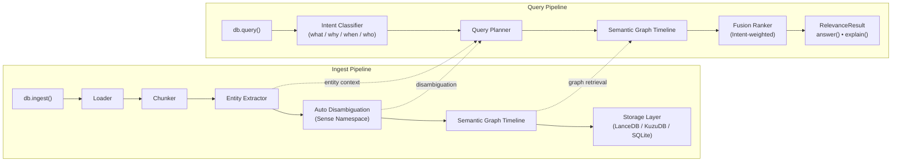

# RelevanceDB

> **VectorDBs find similar. RelevanceDB finds relevant.**

```bash
pip install relevancedb
```

```python
from relevancedb import RelevanceDB

db = RelevanceDB()
db.ingest(["policy.txt", "meeting_notes/"])

result = db.query("who approved the retention policy change?")
print(result.answer)
print(result.explain())
```

## Architecture Overview


Three storage heads. One fusion layer. Zero config from the user.

| Head | Storage | Solves |
|---|---|---|
| Semantic | LanceDB | Context-scoped vectors, namespaced per entity sense |
| Graph | KuzuDB | Relationships, causal chains, decisions |
| Timeline | SQLite | Document versions, recency, temporal decay |

## What is novel

**Auto-disambiguation at index time.** Before embedding, RelevanceDB reads surrounding context and assigns a sense namespace per entity. "Strawberry" the Apple project and "strawberry" the fruit are stored in separate namespaces and can never pollute each other's search results.

**Intent-routed retrieval.** Every query is classified as `what / why / when / who / how` before retrieval. A `why` query hits the graph head first. A `when` query hits the timeline head first. A `what` query starts with semantic. No other RAG library does this routing.

**Intent-weighted fusion.** Results from all heads are combined using a weight matrix derived from query intent not a fixed average. Graph results matter more for `who` queries. Timeline decay matters more for `when` queries.

## License

MIT